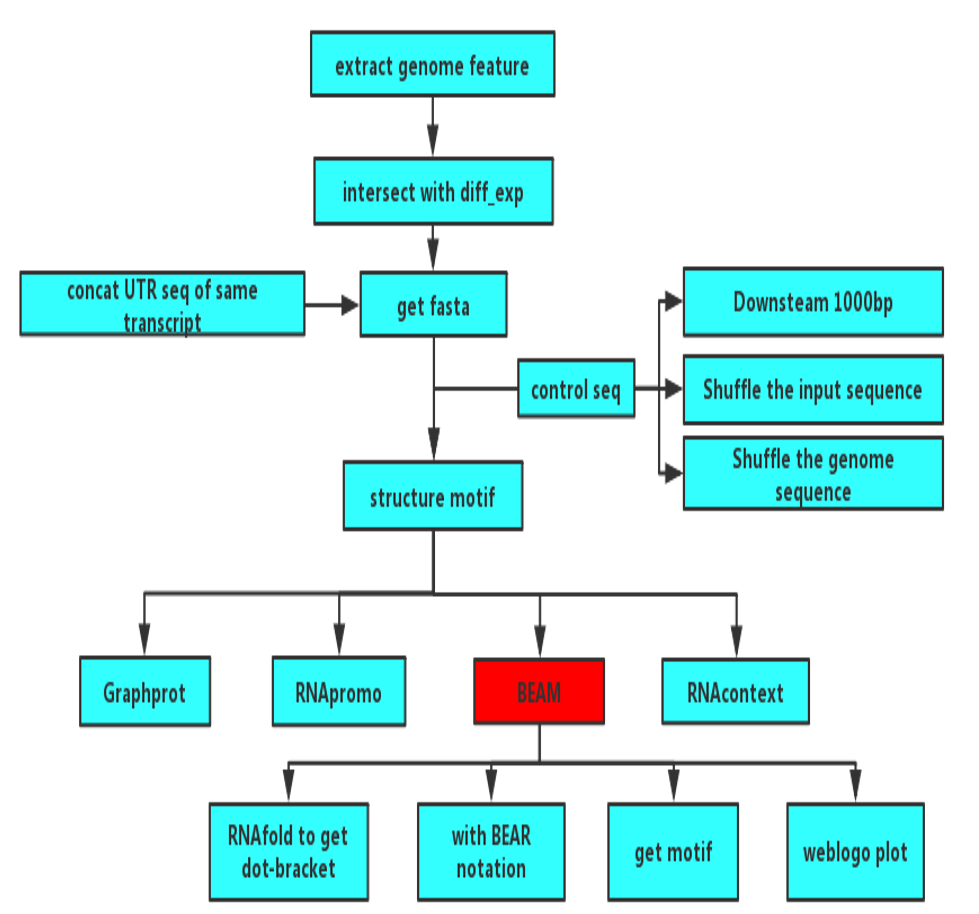
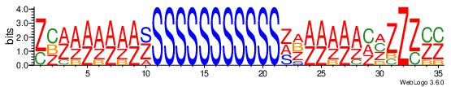

# structure motif analysis
This is a document for structure motif analysis.

## workflow

<div align = center>

</div>

## 1 get 3'-UTR and promoter sequence
### 1.1 install R package GenomicFeatures and biozhuoer tools
* **GenomicFeatures** package used to extract needed sequence
* **biozhuoer** tools used to concat sequences of the same 3’ UTR or promoter
```r
source("http://www.bioconductor.org/biocLite.R")
biocLite("GenomicFeatures")
library(GenomicFeatures)

if (!('devtools' %in% .packages(T))) install.packages('devtools');
devtools::install_github('dongzhuoer/biozhuoer');
```
### 1.2 generate txdb object
There are many functions for us to get genme annotation file:
* makeTxDbFromBiomart  
* makeTxDbFromEnsembl  
* makeTxDbFromGFF      
* makeTxDbFromGRanges  
* makeTxDbFromUCSC
Here we use makeTxDbFromGFF for the existing of gtf file.
```r
gtf_file="/BioII/lulab_b/songyabing/genome/gencode.v27.annotation.gtf"
txdb <- makeTxDbFromGFF(gtf_file, format="gtf")
```
### 1.3 get 3'UTR & 5'UTR site range
```r
utr5p = fiveUTRsByTranscript(txdb, use.names=T)
utr3p = threeUTRsByTranscript(txdb, use.names=T)

utr3p.df=as.data.frame(utr3p)
utr5p.df=as.data.frame(utr5p)

write.table(utr3p.df, "utr3p.info", row.names=FALSE, sep='\t',quote=FALSE )
write.table(utr5p.df, "utr5p.info", row.names=FALSE, sep='\t' ,quote=FALSE)
```
### 1.4 get promoter site range
```r
promoter=promoters(txdb)
promoter.df=as.data.frame(promoter)
write.table(promoter.df, "promoter.info", row.names=FALSE, sep='\t' ,quote=FALSE)
```
## 2 intersect with diff_expr_gene
intersect with diff_exp_genes & get interested genes' info      
### 2.1 interested 3'UTR
* 1st column:chr
* 2nd column:gene
* 3rd column:transprict
* 4th column:exon_name 
* 5th column:start
* 6th column:end
* 7th column:width(seq length)
* 8th column:strand
* 9th column:exon_id
* 10th column:exon_rank
```bash
sort -t $'\t' -k 2 utr3p.info|join -o 1.3 2.1 1.2 1.9 1.4 1.5 1.6 1.7 1.8 1.10 -t $'\t' -1 2 -2 2 - \
  <(cut -f 1 SC2_SF2.ct.dn.1_0.01.protein_coding |sort |join -t $'\t' -1 1 -2 1 - <(sort -t $'\t' -k 1 \
  <(grep -o -P -e "gene_id.*; transcript_id.*?;" gencode.v27.annotation.gtf |sort \
  |uniq|sed -e 's/gene_id "//' -e 's/"; transcript_id "/\t/' -e 's/";//'))|sort -t $'\t' -k 2  ) |\
  sort -t $'\t' -k 1 >interested_three_prime_UTR.info
```
### 2.2 interested promoter
* 1st column:chr
* 2nd column:gene
* 3rd column:transprict_name
* 4th column:start
* 5th column:end
* 6th column:width(seq length)
* 7th column:strand
* 8th column:transprict_id
```bash
sort -t $'\t' -k 7 promoter.info|join -o 1.1 2.1 1.7 1.2  1.3 1.4 1.5 1.6 -t $'\t' -1 7 -2 2 - \
  <(cut -f 1 SC2_SF2.ct.dn.1_0.01.protein_coding |sort |join -t $'\t' -1 1 -2 1 - \
  <(sort -t $'\t' -k 1 <(grep -o -P -e "gene_id.*; transcript_id.*?;" gencode.v27.annotation.gtf |sort \
  |uniq|sed -e 's/gene_id "//' -e 's/"; transcript_id "/\t/' -e 's/";//' ))|sort -t $'\t' -k 2  ) |\
  sort -t $'\t' -k 1 >interested_promoter.info
```
## 3 convert to BED format
### 3.1 3'UTR bed info 
* 1st column:chr
* 2nd column:start
* 3rd column:end
* 4th column:gene
* 5th column:transprict
* 6th column:strand

**change for subsequent concat seq where 4th column: transcript 5th column: gene**
```bash
cat interested_three_prime_UTR.info | \
  awk '{print $1 "\t" $5-1 "\t" $6 "\t" $3 "\t" $2 "\t" $8}' | \
  sort -u  > interested_three_prime_UTR.bed
```
### 3.2 promoter bed info 
* 1st column:chr 
* 2th column:start
* 3th column:end
* 4nd column:gene
* 5rd column:transprict_name
* 6th column:strand

**change for subsequent concat seq where 4th column: transcript 5th column: gene**
```bash
cat interested_promoter.info | \
  awk '{print $1 "\t" $4-1 "\t" $5 "\t" $3 "\t" $2 "\t" $7}' | \
  sort -u  > interested_promoter.bed
```
## 4 get genome sequence
### 4.1 get 3'UTR related genome sequence
* -s: Force strandedness. If the feature occupies the antisense strand, the sequence will be reverse complemented. 
* -name:	Use the “name” column in the BED file for the FASTA headers in the output FASTA file.
* -fi: input FASTA
* -fo: Specify an output file name. By default, output goes to stdout.
```{bash,eval=FALSE}
bedtools getfasta -s -name -fi GRCh38.p10.genome.fa \
  -bed interested_three_prime_UTR.bed -fo interested_three_prime_UTR.fa
```
### 4.2 concatenate sequences of the same 3’ UTR
```r
concatenate_seq <- function(fasta_file) {
    biozhuoer::read_fasta(fasta_file) %>% 
        dplyr::mutate(name = stringr::str_extract(name, 'ENST[\\d\\.]+')) %>% 
        dplyr::group_by(name) %>% dplyr::summarise(seq = paste0(seq, collapse = '')) %>% 
        biozhuoer::write_fasta(fasta_file)
}
concatenate_seq('interested_three_prime_UTR.fa')
```

### 4.3 get promoter related genome sequence
```bash
bedtools getfasta -s -name -fi GRCh38.p10.genome.fa \
  -bed interested_promoter.bed -fo interested_promoter.fa
```

### 4.4 concatenate sequences of the same promoter
> For the purpose of concat transcript seq with same promoter ,we should change the columns order of the bed file **(with the 4rd column is transcript name)**.
```{r,eval=FALSE}
concatenate_seq <- function(fasta_file) {
    biozhuoer::read_fasta(fasta_file) %>% 
        dplyr::mutate(name = stringr::str_extract(name, 'ENST[\\d\\.]+')) %>% 
        dplyr::group_by(name) %>% dplyr::summarise(seq = paste0(seq, collapse = '')) %>% 
        biozhuoer::write_fasta(fasta_file)
}
concatenate_seq('interested_promoter.fa')
```

## 5 get random sequence as bg sequence
there are three mothods to get random sequence: 

* shuffle the input sequence 
* downsteam 1000bp  
* bedtools shuffle

### 5.1 shuffle the input sequence
```bash
fasta-shuffle-letters interested_three_prime_UTR.fa interested_three_prime_UTR.control

fasta-shuffle-letters interested_promoter.fa interested_promoter.control
```

### 5.2 downstream 1000bp as bg 
> https://dongzhuoer.github.io/diff_exp_2018_zhuoer/motif.html 
```r
slide <- function(input_bed, output_bed, n = 1000) {
    col_names <- c('chr', 'start', 'end', 'name', 'score', 'strand');

    original <- readr::read_tsv(input_bed, col_names) %>% 
        dplyr::group_by_at(-2:-3) %>% 
        dplyr::summarise(length = sum(end - start), end = max(end)) %>% 
        dplyr::ungroup()
    
    if (n > 0) {
       slide <- original %>% dplyr::mutate(start = end + n, end = start + length)
    } else {
       slide <- original %>% dplyr::mutate(end = start + n, start = end - length)
    }
    
    slide %>% dplyr::select(chr, start, end, name, score, strand) %>% 
        readr::write_tsv(output_bed, col_names = F)
}
slide('interested_three_prime_UTR.bed', 'interested_three_prime_UTR_downstream.bed')
slide('interested_promoter.bed', 'interested_promoter_downstream.bed')
```
**repeat  get promoter and get 3'UTR section**

### 5.3 bedtools shuffle
```bash
bedtools shuffle -i interested_three_prime_UTR.bed \
  -g GRCh38.p10.genome.size >interested_three_prime_UTR_btools.bed

bedtools shuffle -i interested_promoter.bed \
  -g GRCh38.p10.genome.size >interested_promoter_btools.bed
```
**repeat  get promoter and get 3'UTR section**


## 6 get structural motif with Graphprot
> GraphProt supports input sequences in fasta format. The viewpoint mechanism sets viewpoints to all nucleotides in uppercase letters, nucleotides in **lowercase letters are only used for RNA structure predictions**.

### 6.1 get lowercase letters
```bash
awk '{if ($1~/^>/) print;else print tolower($1)}' interested_promoter.fa \
  >interested_promoter_lowercase.fa
```
### 6.2 get control lowercase letters
```bash
awk '{if ($1~/^>/) {print;} else {print tolower($1)}}' interested_promoter.control \
  >interested_promoter_lowercase.control
```
### 6.3 run structural motif with graphprot
**graphprot input sequence will shorter than 300bp**

> In paper ,it says "This way we still allow accurate folding of the mRNA, by considering 150 nucleotides upstream and downstream of the viewpoint."

#### 6.3.1 get optimized parameters
```bash
GraphProt.pl \
--action ls \
--fasta    interested_promoter_lowercase.fa \
--negfasta interested_promoter_lowercase.control \
--prefix   interested_promoter_optim
```
#### 6.3.2 train a model 
```bash
GraphProt.pl \
--action train \
--fasta    interested_promoter_lowercase.fa \
--negfasta interested_promoter_lowercase.control \
--prefix   interested_promoter
--params   interested_promoter_optim.params
```
#### 6.3.3 get structure motif with graphprot
* motif_len: set length of motifs (default: 12)
* -motif_top_n: use use n top-scoring subsequences for motif creation(default: 1000)
```bash
GraphProt.pl \
--action motif \
--model  interested_promoter.model \
--params interested_promoter_optim.params \
--fasta  interested_promoter_lowercase.fa \
--prefix interested_promoter
```

## 7 get structural motif with RNApromo
> In website, it says "The tool is limited to uploading 5000bp sequences (25000bp is the maximum length of allowed uploaded structures, there are no restrictions on negative sequences)"
> https://genie.weizmann.ac.il/pubs/rnamotifs08/rnamotifs08_predict.html
* -min <num>  Minimal motif size (default = 15).
* -max <num>  Maximal motif size (default = 70).
* -bg <num>   Ignore motifs with p-value > <num> (Default = 0.01). The p-value is calculated for the number of times the motif appears in the input set, using the given BG model.
* -p <n|b>    Use normal or binomial distribution to calculate pvalues (default: binomial).
```bash
./rnamotifs08_motif_finder.pl \
-positive_seq interested_promoter.fa \
-negative_seq interested_promoter.control \
-output_dir Output
```
* run print no results

## 8 get structural motif with BEAM
### 8.1 get corresponding RNA sequence
> It needs RNA sequence, we could replace it here or use following --noconv para  
> website: https://github.com/noise42/beam

#### 8.1.1 get promoter corresponding RNA sequence 
```bash
awk '{if ($1~/^>/) print;else {gsub(/T/,"U",$1);print;}}' interested_promoter.fa >interested_promoter_rna.fa

awk '{if ($1~/^>/) print;else {gsub(/T/,"U",$1);print;}}' interested_promoter.control >interested_promoter_rna.control
```
#### 8.1.2 get UTR corresponding RNA sequence 
```bash
awk '{if ($1~/^>/) print;else {gsub(/T/,"U",$1);print;}}' interested_three_prime_UTR.fa  >interested_three_prime_UTR_rna.fa

awk '{if ($1~/^>/) print;else {gsub(/T/,"U",$1);print;}}' interested_three_prime_UTR.control  >interested_three_prime_UTR_rna.control
```
### 8.2 get fastB format
#### 8.2.1 use RNAfold to get dot-bracket
> RNAfold tutorial:https://www.tbi.univie.ac.at/RNA/tutorial/
* --noconv：Do not automatically substitute nucleotide "T" with "U" (default=off) , we can input DNA seq

Compute the best (MFE) structure for this sequence (primary sequence with dot-bracket)
```bash
RNAfold  < interested_promoter_rna.fa >dot.fa
```
#### 8.2.2 Get file with BEAR notation ---> fastB (fastBEAR).
```bash
awk '/^>/ {print; getline; print; getline; print $1}' dot.fa >dot_to_encode.fa

java -jar BearEncoder.new.jar dot_to_encode.fa  BEAMready.fa
```
### 8.3 get motif without pictures
```{bash,eval=FALSE}
# -w Min motif Width (10)
# -W Max motif Width (50)
# -M masks (1) - number of masks(motifs) to be computed
# -g backGround  fastB (fastBEAR) format
# -f input file  fastB (fastBEAR) format
java -jar BEAM_release1.6.1.jar -f BEAMready.fa -g bg.fa -w 10 -W 40 -M 3 
```
### 8.4 plot motif with weblogo
#### 8.4.1 install weblogo
```bash
pip install weblogo
```
#### 8.4.2 plot with suggested command
> we should not only specify **-o** option with format suffix, we should also specify **-F** with format
```bash
# -o:Output file (default: stdout)
# -F:Format of output: eps (default), png, png_print, pdf, jpeg, svg, logodata
weblogo -a 'ZAQXSWCDEVFRBGTNHY' -f BEAMready_m1_run1_wl.fa -D fasta \
-o out.jpeg -F jpeg --composition="none" \
-C red ZAQ 'Stem' -C blue XSW 'Loop' -C forestgreen CDE 'InternalLoop' \
-C orange VFR 'StemBranch' -C DarkOrange B 'Bulge' \
-C lime G 'BulgeBranch' -C purple T 'Branching' \
-C limegreen NHY 'InternalLoopBranch'
```
#### 8.4.3 example output

<div align = center>
  
</div>


## 9 get structural motif with RNAcontext
**input files(here we don't have the first file):**

* A set of sequnces together with their estimated binding affinities 
* RNA secondary structure annotations of the sequences estimated using SFOLD (details are below).
* run RNAcontext with long sequences (e.g. mRNAs) use RNAplfold instead of Sfold

### 9.1 get annotation files
```bash
#use -W 80 -L 40 for fly and yeast and -W 240 -L 160 for mouse and human. 
./E_RNAplfold -W 240 -L 160 -u 1 <interested_promoter.fa >E_profile.txt
./H_RNAplfold -W 240 -L 160 -u 1 <interested_promoter.fa >H_profile.txt
./I_RNAplfold -W 240 -L 160 -u 1 <interested_promoter.fa >I_profile.txt
./M_RNAplfold -W 240 -L 160 -u 1 <interested_promoter.fa >M_profile.txt
```
### 9.2 combine the four annotation files 
> python version 2.x,otherwise bug:‘float’ object cannot be interpreted as an integer
```python
python combine_letter_profiles.py E_profile.txt H_profile.txt I_profile.txt M_profile.txt 1 combined_profile.txt 
```
### 9.3 Example Run 
```bash
# -w    <motifwidth range> (default 4-10)
# -c    <training input filename>. format:intensity \tab sequence 
# -d 	  <test input filename>.  format:intensity \tab sequence 
# -h 	  <annotation profile for training sequences> 
# -n 	  <annotation profile for test sequences>
# -o 	  <output filename key>
# -s    <number of initializations or restarts> (default 5). It's useful to set s at least 3.  
# -a 	  <alphabet> (default ACGU). ACGT if you're using DNA sequences
# -e    <annotation alphabet> (default PLMU). with SFOLD should use alphabet -PHIME
 ./bin/rnacontext -w 4-5 -a ACGU \
 -e PLMU -s 3  -c  VTS1_training_sequences.txt  \
 -h VTS1_training_annotations.txt \
 -d VTS1_test_sequences.txt \
 -n VTS1_test_annotations.txt -o  VTS1_demo  
```
